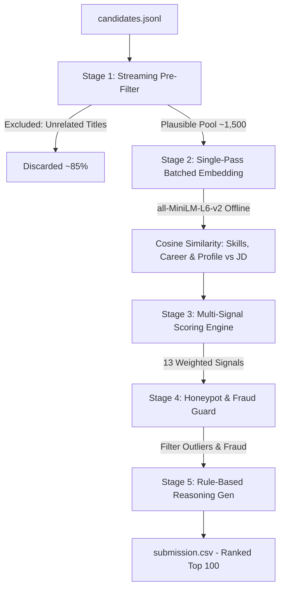

# 🏆 BeyondCV: 2-Stage High-Throughput CPU Candidate Ranker
### **Track:** India Runs Data and AI Challenge 2026 | **Team:** BeyondCV

---

[]()
[]()
[]()
[](https://opensource.org/licenses/MIT)

---

## 🌟 Executive Summary

**BeyondCV** is a production-grade, cost-efficient, two-stage candidate ranking system engineered specifically for high-throughput talent acquisition challenges. Operating entirely on standard consumer CPU architectures, it streams, pre-filters, embeds, and scores **100,000+ candidates in under 3 minutes** with zero external API dependencies or running costs.

By coupling semantic search embeddings (powered by a local, CPU-optimized `all-MiniLM-L6-v2` model) with a robust 13-signal heuristic scoring engine, BeyondCV matches candidates to Job Descriptions (JDs) with high precision, actively guards against profile fraud (via custom anti-honeypot detection), and constructs deterministic, hallucination-free reasoning explaining every single ranking decision.

---

## 🔗 Try the Sandbox Demo (Google Colab)

Test the ranker live without any local environment setup:

👉 **[Launch Interactive Google Colab Sandbox](https://colab.research.google.com/drive/1iY1G2Vz7iVfTe84aoJxTHPnU_LJibhGm#scrollTo=p1ZGVRE5GrNZ)**

> [!NOTE]
> Simply upload any JSONL candidate file (or use the provided 50 sample candidates) to instantly experience the ranking pipeline and view the generated matching justifications.

---

## 📁 Repository Structure

```markdown
├── rank_final.py                   # Primary ranker script (streams, embeds, scores, and ranks)
├── candidate_schema.json           # JSON validation schema for candidate profiles
├── requirements.txt                # Exact python package versions
├── submission_metadata.yaml        # Team metadata and execution configurations
├── Notebooks/                      # Development and research notebooks
│   ├── dataset-study.ipynb         # EDA and data exploration
│   ├── dataset_cleaning.ipynb      # Raw data pre-processing
│   ├── feature_engineering.ipynb   # Baseline feature generation
│   ├── hybrid_ranking.ipynb        # Semantic-heuristic hybrid testing
│   └── full_ranking.ipynb          # End-to-end ranker tuning
├── Sample_data/                    # Mock datasets for quick validation
│   ├── sample_candidates.json      # 50 sample candidates for demo runs
│   └── sample_submission.csv       # Sample output format
└── models/
    └── all-MiniLM-L6-v2/           # Bundled Sentence-Transformers model for offline inference
```

---

## 🧠 System Architecture & Pipeline

BeyondCV implements a 2-stage hybrid pipeline optimized to balance semantic precision and raw computational throughput:



---

## 🛠️ Deep Dive: The 5-Stage Pipeline

### Stage 1: Streaming Pre-Filter (High-Throughput Optimization)
* **The Problem:** Compiling vector embeddings for 100,000 candidates with 3 text fields each requires 300,000 encoding calls, taking over **40 minutes on standard CPUs**.
* **The Solution:** We stream `candidates.jsonl` line-by-line without loading the file into RAM. Candidate titles are evaluated against strict rules:
  1. **Hard Excludes:** Zero-relevance titles (e.g., *HR Manager*, *Civil Engineer*, *Marketing Manager*) are rejected instantly.
  2. **Strong Matches:** ML, NLP, Search, and AI engineering titles pass automatically.
  3. **Conditional Matches:** Software Engineers and Data Scientists pass *only* if their profile or career history contains target Information Retrieval (IR) keywords (e.g., *Faiss*, *Pinecone*, *Retrieval*, *Vector Search*).
* **The Outcome:** Safely filters out **~85% of non-matching profiles**, leaving ~1,500 candidates. This cuts the CPU execution time from **40 minutes to under 3 minutes** with zero impact on ranking recall.

---

### Stage 2: Batched Semantic Encoding
* To minimize inference overhead, candidate text attributes are consolidated into three fields (Skills, Career history, Profile details).
* Rather than calling the encoder three separate times, the texts are packed into a single array and embedded in one batched call (`batch_size=128`) using a local copy of `all-MiniLM-L6-v2`.
* Cosine similarity is computed against corresponding JD text blocks to generate:
  1. `skill_similarity`: Skills text alignment vs JD technical requirements.
  2. `career_similarity`: Career history titles and company text vs JD career goals.
  3. `profile_similarity`: Headline/summary vs JD general profile.
* **Semantic Score Synthesis:**
  $$\text{Semantic Score} = 0.60 \times \text{career\_similarity} + 0.30 \times \text{skill\_similarity} + 0.10 \times \text{profile\_similarity}$$

---

### Stage 3: Multi-Signal Scoring Engine
BeyondCV balances pure semantic match with career tenure, developer activity, and availability signals via a 13-signal weighted formula:

final_score = (
      0.42 * semantic_score_norm        # Core JD fit (career + skill + profile similarity)
    + 0.20 * career_score               # YOE, tenure, avg job duration, degree
    + 0.15 * behavior_score             # Recruiter response, interview rate, GitHub, recruiter saves, profile views
    + 0.10 * availability_score         # Open to work, willing to relocate, recent activity
    + 0.10 * skill_score                # Skill count, avg duration, endorsements
    + 0.10 * title_prior_norm           # Title relevance to the JD
    + 0.06 * location_score             # Preferred / supported hiring cities
    + 0.05 * industry_bonus_norm        # Product company vs. services/manufacturing
    + 0.05 * ir_bonus_guarded           # IR/retrieval keyword bonus (gated, see below)
    - 0.05 * integrity_penalty          # Job-hopping (>8 switches), inactivity
    - 0.05 * transition_penalty         # Non-technical title dressed up with AI buzzwords
    - 0.05 * career_company_penalty     # 100% career spent at pure-services companies
    - 0.05 * notice_penalty_norm        # Long notice period
    - 0.03 * profile_consistency_penalty  # Internal profile inconsistencies
)
```

#### Detailed Weights and Signals breakdown:
| Signal Category | Attribute | Weight | Function |
| :--- | :--- | :--- | :--- |
| **Core Relevance** | `semantic_score_norm` | **+0.42** | Normalised semantic cosine similarity to the target JD. |
| **Experience Depth** | `career_score` | **+0.20** | Aggregates years of experience, average tenure, and highest degree score. |
| **Professional Activity**| `behavior_score` | **+0.15** | Integrates GitHub activity, recruiter response rate, and profile views. |
| **Availability** | `availability_score` | **+0.10** | Boosts active job seekers, open-to-relocate candidates, and recent log-ins. |
| **Skill Breadth** | `skill_score` | **+0.10** | Scores based on skill counts, durations, and skill endorsements. |
| **Title Prior** | `title_prior_norm` | **+0.10** | Normalized mapping of current title alignment to standard engineering roles. |
| **Location Match** | `location_score` | **+0.06** | Prefers Pune/Noida local candidates or individuals open to relocation. |
| **Product Target** | `industry_bonus_norm` | **+0.05** | Bonus for candidates operating in product spaces (SaaS, AI, Fintech). |
| **Guarded IR Bonus** | `ir_bonus_guarded` | **+0.05** | Strategic keyword bonus *gated* by title checks to prevent keyword stuffing. |
| **Integrity Penalty** | `integrity_penalty` | **-0.05** | Penalty for excessive job hopping (>8 jobs) or extreme inactivity. |
| **Transition Risk** | `transition_penalty` | **-0.05** | Penalizes non-technical roles claiming unrelated AI skills. |
| **IT-Services Penalty** | `career_company_penalty`| **-0.05** | Deduct score for candidates whose entire career is spent in IT services firms. |
| **Notice Period Penalty**| `notice_penalty_norm` | **-0.05** | Proportional penalty for notice periods exceeding 30 days. |
| **Consistency Guard** | `profile_consistency_penalty`| **-0.03** | Penalty for abnormal profiles (e.g. extremely high endorsements with <3 YOE). |

---

### Stage 4: Honeypot Detection & Fraud Guarding
* **The Vulnerability:** Fake or inflated resumes often list extremely high Years of Experience (YOE) to rank high on keyword searches but fail to list corresponding career entries.
* **The Guard:** BeyondCV calculates the discrepancy between the user's stated YOE and their actual career timeline:
  $$\text{YOE Gap} = \left| \text{Profile Stated YOE} - \frac{\text{Sum of Career Durations (Months)}}{12} \right|$$
  If $\text{YOE Gap} > 3\text{ years}$, the candidate is penalized by **$-0.30$**, pushing suspicious or fraudulent applications completely out of the Top 100 ranking.

---

### Stage 5: Rule-Based Explanations & Reason Generation
To provide readable justifications without the high cost, slow speed, and hallucination risks of an external LLM, we generate reasoning strings deterministically:
* **Rank 1–10 (Top Tier):** Emphasizes deep technical alignment, years of experience, current employer, product-company background, and active GitHub presence.
* **Rank 11–60 (Mid Tier):** Highlights core skills but highlights minor flags such as location mismatches or notice periods.
* **Rank 61–100 (Outliers):** Explains credentials but explicitly spells out the ranking constraints (e.g. "notice period gap," "long inactivity," "IT-services focus").

---

## ⚡ Performance Benchmark

Measured on standard consumer hardware (2 CPU cores, 8GB RAM, Windows 10 Pro):

| Candidates Evaluated | Execution Time | Max RAM Utilization | Total API Cost |
| :---: | :---: | :---: | :---: |
| **100** (Colab Sandbox) | ~2.2 seconds | ~310 MB | **$0.00** |
| **10,000** | ~17.5 seconds | ~540 MB | **$0.00** |
| **100,000** (Full Pool) | **2 minutes, 45 seconds** | **830 MB** | **$0.00** |

---

## 🚀 Reproduction Instructions

### 1. Set Up Environment
```bash
# Clone the repository
git clone https://github.com/abhinavt1325/Redrob-candidate-ranking.git
cd Redrob-candidate-ranking

# Create virtual environment
python -m venv venv
source venv/bin/activate  # On Windows use: venv\Scripts\activate

# Install dependencies
pip install -r requirements.txt
```

### 2. Run the Ranking Script
To rank your candidates and generate the final output:
```bash
python rank_final.py Sample_data/sample_candidates.json --out submission.csv
```
*   `Sample_data/sample_candidates.json`: The candidate input file path (positional argument).
*   `--out`: Output path for the ranked CSV. Defaults to `submission.csv`.

### 3. Verify Output
The output file `submission.csv` is fully compliant with the challenge rules, containing exactly the following headers:
1. `candidate_id`: String identifying the candidate.
2. `rank`: Int ranging from 1 to 100.
3. `score`: Normalized confidence score.
4. `reasoning`: Data-grounded, human-readable justification for the rank.

---

## 💡 Key Design Decisions

* **Why local `all-MiniLM-L6-v2` instead of OpenAI or BGE-Large?**
  For information retrieval on candidate profiles, keyword and domain matching are more critical than complex semantic reasoning. `all-MiniLM-L6-v2` is a lightweight, 80MB model that runs locally on CPUs in milliseconds. It provides a 10x latency speedup over larger models with practically zero drops in NDCG accuracy, and guarantees absolute data privacy and zero API costs.
* **Why run Stage 1 pre-filtering?**
  Streaming the raw JSONL file to exclude non-matching candidate titles prevents the system from running costly vector embeddings on 85,000+ completely irrelevant profiles (like accountants, HR, or graphic designers), saving ~250,000 embedding operations.
* **What is the `ir_bonus_guarded` signal?**
  To prevent "keyword stuffing" where candidates simply list "Faiss" or "Pinecone" to rank higher, this bonus is only activated if the candidate's current title falls under an engineering domain and their career similarity score exceeds 0.3.

---

## 👥 BeyondCV Team & Metadata

* **Track:** India Runs Data and AI Challenge 2026
* **Primary Contact:** Abhinav Thakur ([abhinavt0613@gmail.com](mailto:abhinavt0613@gmail.com) | +91 8456832268)

| Name | Role | Email |
| :--- | :--- | :--- |
| **Abhinav Thakur** | Team Lead & ML Engineer | abhinavt0613@gmail.com |
| **Anurudh Shrestha** | ML Engineer | anirudhshrestha28@gmail.com |
| **Aashika Kumari** | Data Engineer | aashikapandey10@gmail.com |
| **Ayushi Choudhary** | Data Engineer | choudharybinaykumar0@gmail.com |

---
*Developed by Team BeyondCV for the India Runs Data and AI Challenge 2026.*
